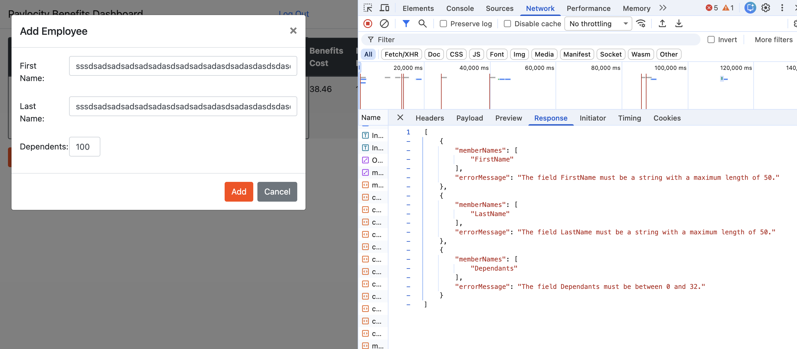

#### DF-003

### Sumary

Benefits Dashboard - Values max lenght

### Type

FE

### Description

Limits for First/Last name = max 50 character
Limit for Dependents = 0-32

There are missing error messages at FE Benefits Dashboard for invalid input for First/Last name and Dependents.
It can be confusing for user

HAR: [valueMaxLenght.har](../data/valueMaxLenght.har)
Date: Sun, 29 Mar 2026 11:41:35 GMT

###### Steps to reproduce:

1. Log in to FE
2. On the "Benefits Dashboard" page, click the "Add Employee" button
3. Input Employee First/Last Name longer then 50 characters
4. Input Dependents number lover than 0 or higher than 32
5. Click the "Submit" button
6. Nothing happens on FE

###### Screenshot:

### Severity

Low
