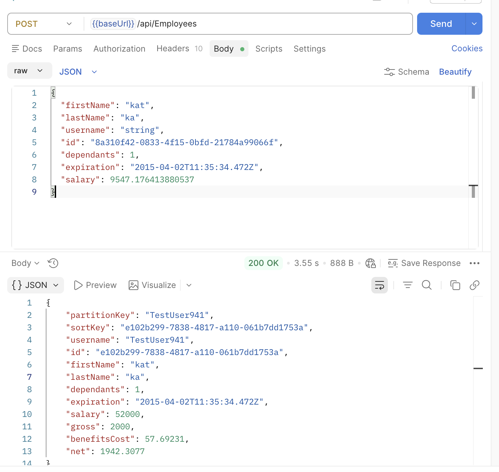
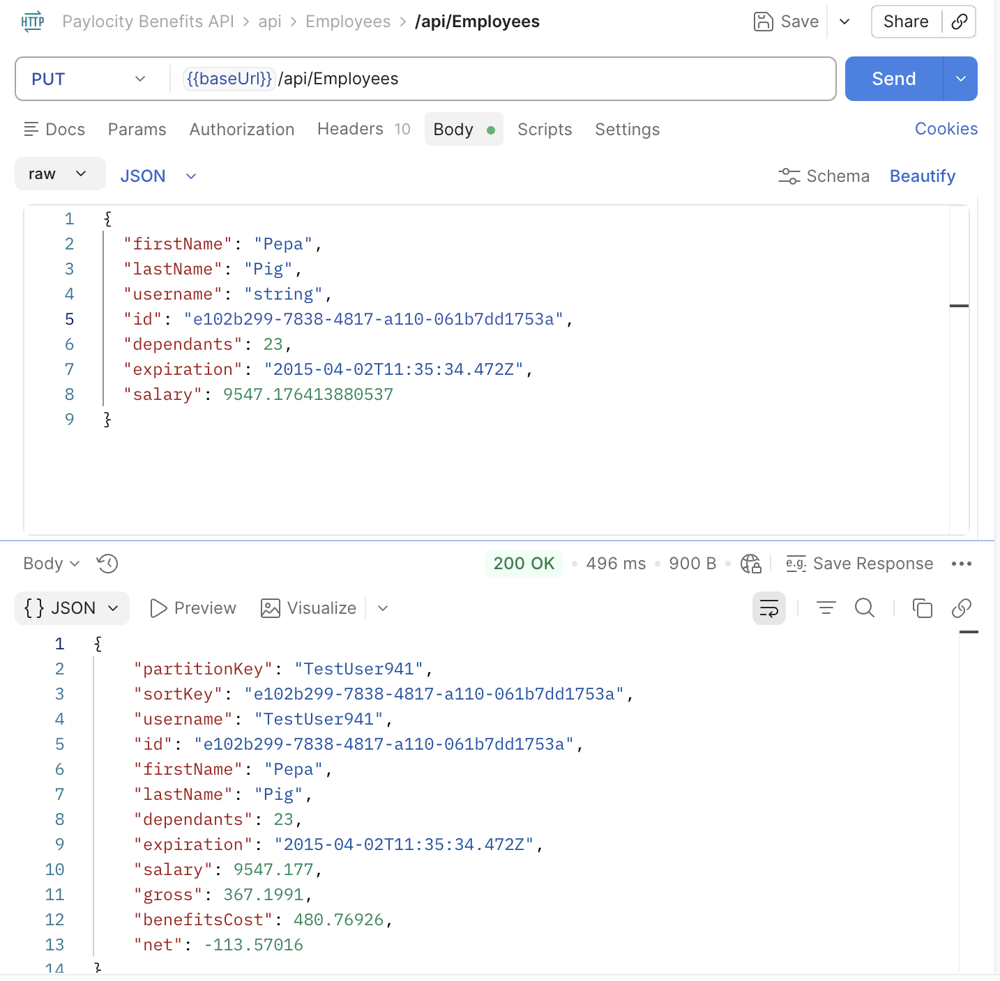

#### DF-004

### Sumary

Benefits Dashboard - POST/PUT - Salary

### Type

BE

### Description

With POST API user cannot change salary ammount, but with PUT API you can.
It was stated that all emplyees will have salary 52000 and it wasn't specified if PUT API can change this ammount.

POST/PUT API: https://wmxrwq14uc.execute-api.us-east-1.amazonaws.com/Prod/api/Employees

###### Steps to reproduce:

1. Call POST API
2. Salary is 52000
3. Call PUT API with id from POST body and different salary amount
4. Salary amount in PUT respond and FE is not 52000

###### Screenshot:

### Severity

Medium
