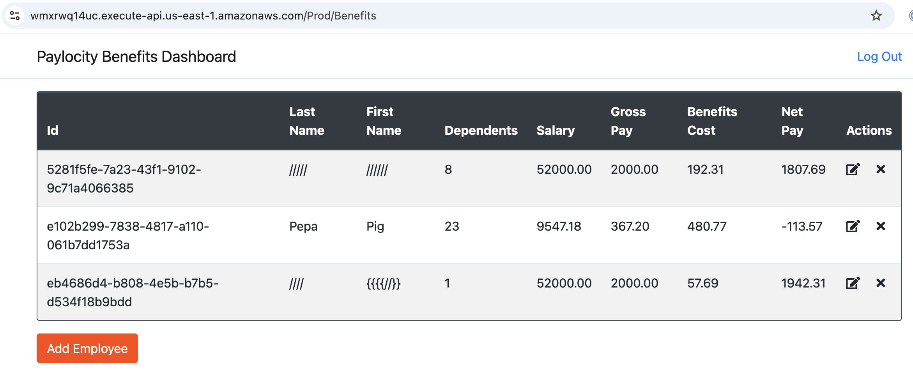
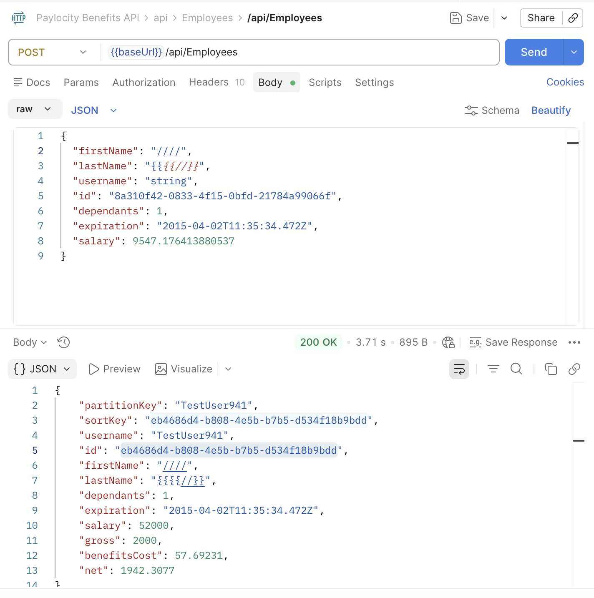

#### DF-005

### Sumary

Benefits Dashboard - First/Last name - special characters

### Sumary

BE/FE

### Description

User can add employee both through FE or API with special characters and numbers. 
Only letters (maybe letters with diacritics) should be allowed.

POST/PUT API: https://wmxrwq14uc.execute-api.us-east-1.amazonaws.com/Prod/api/Employees

###### Steps to reproduce BE:

1. Call POST/PUT API with special characters (/,],[,{,}) in request body: "firstName" and "firstName"
2. In respond body, there are special characters i nplace of "firstName" and "firstName"

###### Steps to reproduce FE:

1. Log in to FE
2. On the "Benefits Dashboard" page, click the "Add Employee" button
3. Input Employee First/Last Name with special characters (/,],[,{,})
4. Input Dependents number between 0-32
5. Click the "Submit" button
6. Employee is saved with special characters

###### Screenshot:

### Severity

Hight