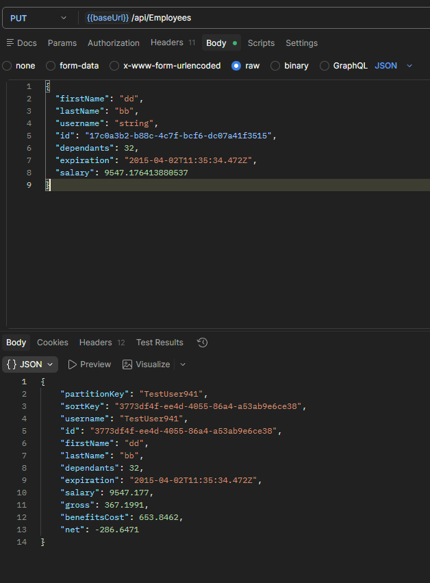
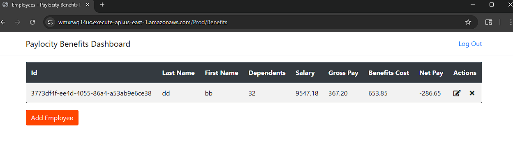

#### DF-007

### Sumary

Benefits Dashboard - Creating client with PUT API

### Type

BE

### Description

Calling PUT API with nonexisting id will create a new employee with unique id.
Repeating PUT API call will keep creating new emploeyees.

PUT can be used to create or replace a resource at a known URL. But it's not the best practice.
Specificaly because ids are generated on server side.

PUT API: https://wmxrwq14uc.execute-api.us-east-1.amazonaws.com/Prod/api/Employees

###### Steps to reproduce:

1. Call PUT API with nonexisting id
2. New Emploeyy is created
3. Call PUT API with the same id as before
4. New Emploeyy is created

### Severity

Medium

###### Screenshot:

