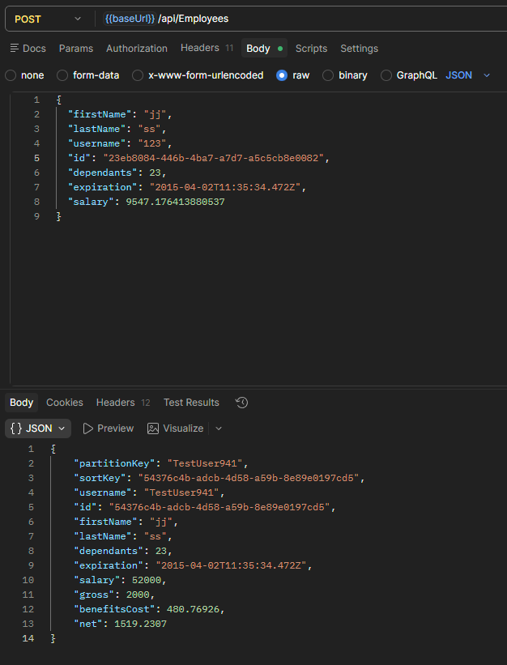

#### DF-008

### Sumary

Benefits Dashboard - Expired POST API

### Type

BE

### Description

The backend currently allows clients to submit an expired expiration date when creating an employee. The POST response returns the expired value exactly as sent.

However, when calling GET /Employees, the backend overwrites the expiration date and returns the current day + month instead of the originally submitted value.

POST/GET API: https://wmxrwq14uc.execute-api.us-east-1.amazonaws.com/Prod/api/Employees

###### Steps to reproduce:

1. Call POST API with expired "expiration"
2. In body response is expired "expiration".
3. Call GET API
4. In body response "expiration" is current day.

### Severity

Low

###### Screenshot:

