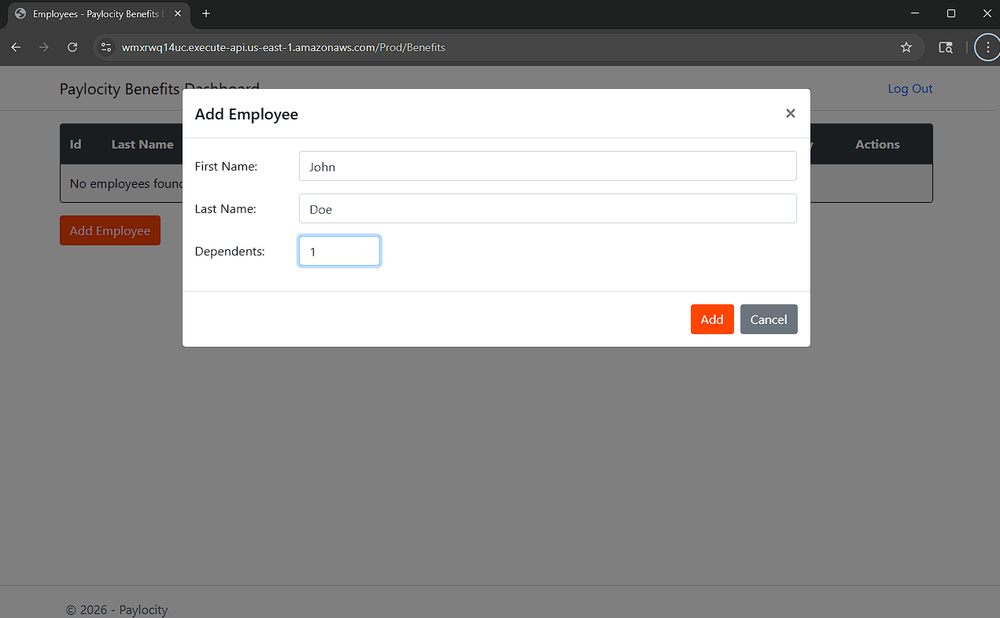
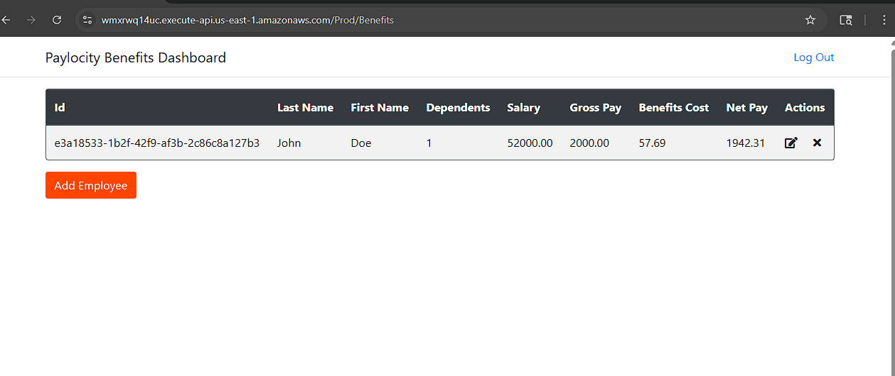
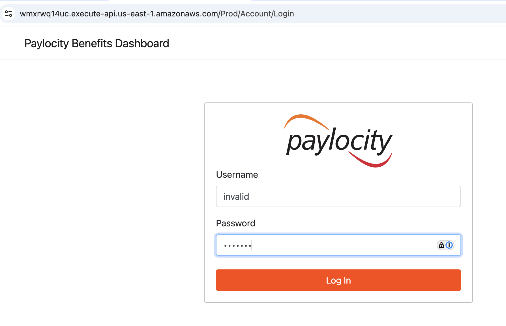
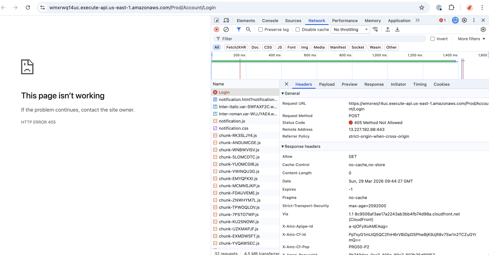

# Defects found while testing Benefits Dashboard

#### DF-002

### Sumary

Benefits Dashboard - Switched first/last name

### Description

Benefits Dashboard has incorect mapping for first and last name.
Values in API are correctly places, but FE is displying them incorectly.

###### Steps to reproduce:

1. Log in to FE
2. On the "Benefits Dashboard" page, click the "Add Employee" button
3. Input any Employee First Name, Last Name & Dependent information.
4. Click the "Submit" button
5. First and Last name are switched

###### Screenshot:

### Severity

Hight

#### DF-002

### Sumary

Benefits Dashboard - Login page - invalid credentials

### Description

Login page for Benefits Dashboard throws HTTP error 405 (Method Not Allowed) after inserting invalid credentails. 
I would expect error message and an option to try again.
It looks like that redirectURL is missing ("_error": "net::ERR_HTTP_RESPONSE_CODE_FAILURE").
If I insert correct username and incorect password, then I get error message. It is potencial vurneability for attacker to get valid usernames at current state.

<       "redirectURL": "",
          "headersSize": -1,
          "bodySize": -1,
          "_transferSize": 438,
          "_error": "net::ERR_HTTP_RESPONSE_CODE_FAILURE",
          "_fetchedViaServiceWorker": false>

HAR: [loginPage.har](../data/loginPage.har)
Date: Sun, 29 Mar 2026 09:44:27 GMT

###### Steps to reproduce:

1. Go to login page
2. Insert invalid credentials and log in
3. HTTP error 405 Method Not Allowed

###### Screenshot:

### Severity

Hight
